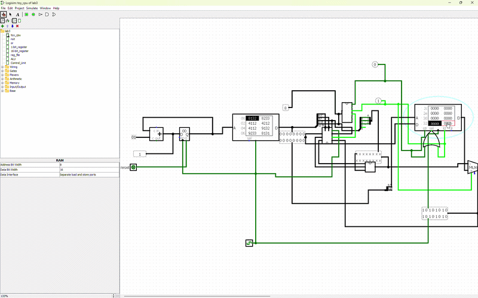
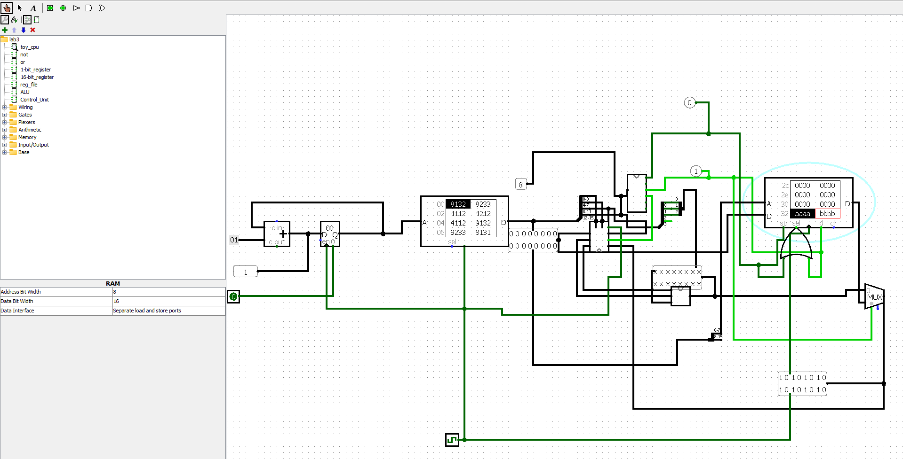
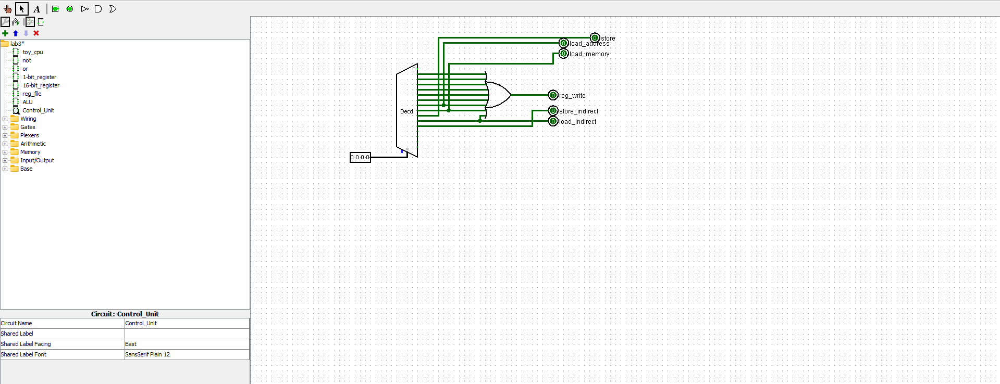
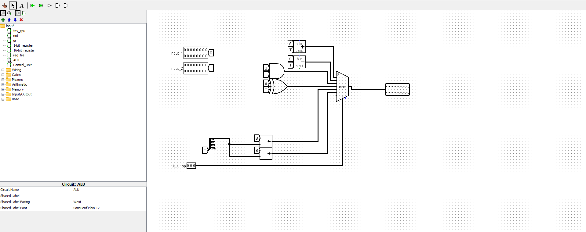
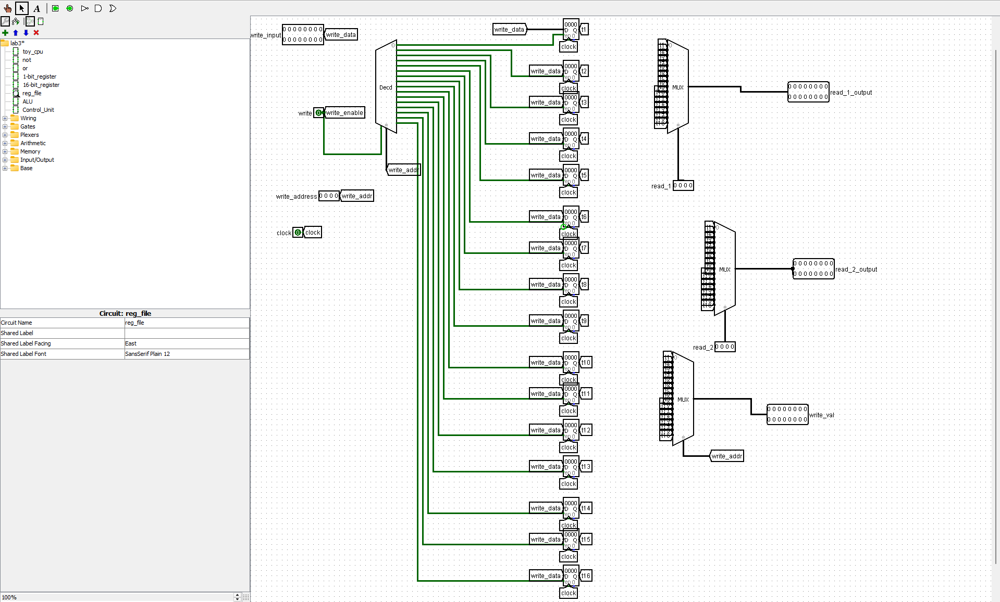
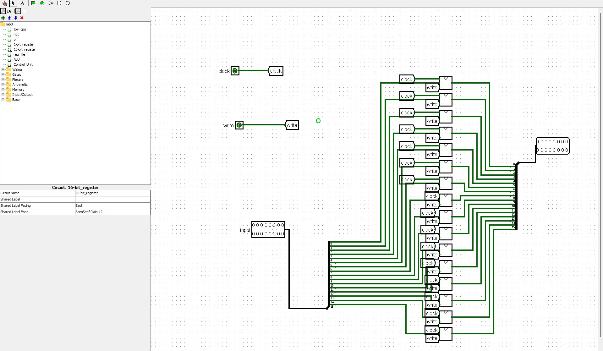
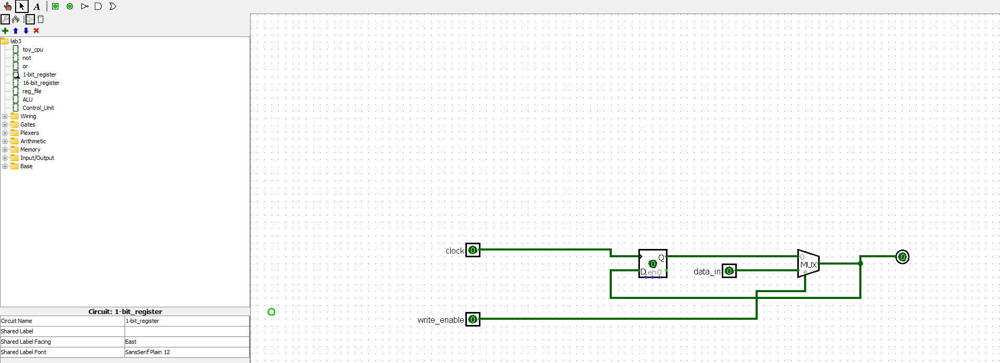

# 16-bit custom Logism CPU Design
A custom 8-bit CPU built from scratch in Logism, with a hand made ALU, register file, and ISA.

# Real time Assembly instruction execution:
The circuit is executing the instructions found in Assembly Instructions (swapping values between Address 32 and 33 without using another register

# Components
### Main Circuit
This connects the control unit, registers, ALU and memory busses.

### Control Unit
This decodes opcodes

### ALU
Handles all mathematical and logical operations

### Register Files and Memory
stores temporary data
* **Register File:** Holds active data

* **16-Bit Register:** Standard register used for data manipulation

* **1-Bit Register:** Used for flags and small state tracking

### Prerequisites
To open and run this project, Logism is required.
